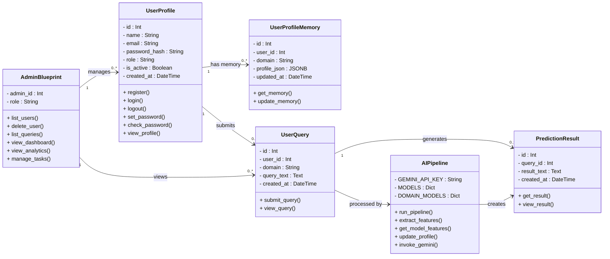

# 3. Class Diagram

A class diagram is a type of structural diagram used in object-oriented design to represent the classes of a system and the relationships among them. It provides a blueprint of how different entities (classes) in a system interact and organize data. Each class is depicted as a box divided into three parts: the top section shows the class name, the middle section lists its attributes (data members), and the bottom section contains its methods (functions). Relationships like inheritance, association, and dependency are shown using connecting lines. Class diagrams are widely used in software design to visualize and plan object-oriented systems.

---

---

*LifeAlly — Class Diagram v1.0.0 · February 2026*
