```mermaid
classDiagram
    direction TB

    %% ================================================================
    %% LAYER 1 — USER FRONTEND  (React, user-ui/)
    %% ================================================================

    class App {
        <<User UI Root>>
        -isAuthenticated boolean
        -isLoading boolean
        +handleLoginSuccess() void
        +handleLogout() void
    }

    class HomePage {
        <<Page>>
        Landing and marketing page
        No auth required
    }

    class LoginPage {
        <<Page>>
        -email string
        -password string
        -isLoading boolean
        +handleSubmit(e) void
    }

    class RegisterPage {
        <<Page>>
        -name string
        -email string
        -password string
        +handleSubmit(e) void
    }

    class DomainSelectorPage {
        <<Page>>
        -selectedDomain string
        +handleDomainSelect(domain) void
        +handleLogout() void
    }

    class ChatPage {
        <<Page>>
        -messages array
        -inputValue string
        -isLoading boolean
        -domain string
        -userId string
        +initializeChat(domain) void
        +handleSendMessage(e) void
    }

    class MarkdownRenderer {
        <<Component>>
        +text string
        Renders bot markdown responses
    }

    class AuthService {
        <<Service>>
        +login(email, password) Response
        +register(name, email, password) Response
    }

    class ChatService {
        <<Service>>
        +predict(domain, text, userId) Response
    }

    class UserAxiosClient {
        <<axios client>>
        +baseURL string
        +requestInterceptor() void
        Attaches UserId header
    }

    %% ================================================================
    %% LAYER 2 — ADMIN FRONTEND  (React + TypeScript, admin-ui/)
    %% ================================================================

    class AdminApp {
        <<Admin UI Root>>
        +PrivateRoute(children) Element
        Checks sessionStorage adminUserId
    }

    class Sidebar {
        <<Component>>
        Navigation dashboard users queries profile
    }

    class Topbar {
        <<Component>>
        +logout() void
    }

    class AdminLoginPage {
        <<Page>>
        -email string
        -password string
        +handleLogin(e) void
    }

    class Dashboard {
        <<Page>>
        -stats object
        +fetchStats() void
    }

    class UsersPage {
        <<Page>>
        -users array
        -page number
        +loadUsers() void
        +handleDelete(userId) void
    }

    class UserView {
        <<Page>>
        -user object
        -queries array
        +loadUser(id) void
    }

    class QueriesPage {
        <<Page>>
        -queries array
        -page number
        +loadQueries() void
    }

    class ProfilePage {
        <<Page>>
        Shows admin role email name
    }

    class DomainChart {
        <<Component>>
        +data object
        Renders domain usage chart
    }

    class AdminTodo {
        <<Component>>
        -todos array
        +addTodo(text) void
        +toggleTodo(id) void
        +deleteTodo(id) void
    }

    class UserDetailModal {
        <<Component>>
        +user object
        +onClose() void
        +onDelete(id) void
    }

    class QueryDetailModal {
        <<Component>>
        +query object
        +onClose() void
    }

    class AdminAxiosClient {
        <<axios client>>
        +baseURL string
        +withCredentials bool
        +requestInterceptor() void
        Attaches adminUserId header
    }

    class AdminAuthAPI {
        <<API Module>>
        +login(email, password) object
        +logout() void
    }

    class AdminAPI {
        <<API Module>>
        +fetchUsers(params) object
        +fetchQueries(params) object
        +deleteUser(userId) object
    }

    %% ================================================================
    %% LAYER 3 — FLASK BACKEND
    %% ================================================================

    class FlaskApp {
        <<Flask Application>>
        +create_app() Flask
        +init_database(app) void
        +health_check() JSON
        +not_found_error(error) JSON
        +internal_error(error) JSON
        +forbidden_error(error) JSON
    }

    class Config {
        <<Configuration>>
        +SECRET_KEY string
        +SQLALCHEMY_DATABASE_URI string
        +SQLALCHEMY_TRACK_MODIFICATIONS bool
    }

    class Extensions {
        <<module>>
        +db SQLAlchemy
    }

    class AuthUtils {
        <<module>>
        +get_user_from_request() UserProfile
        +admin_required(f) Callable
        +login_required(f) Callable
    }

    class AuthBlueprint {
        <<Blueprint prefix api/auth>>
        +register_user() Response
        +login_user() Response
        -normalize_email(e) str
        Werkzeug plus bcrypt password check
    }

    class APIBlueprint {
        <<Blueprint prefix api>>
        +predict() Response
        Validates domain and text
        Loads profile memory
        Persists query and result
    }

    class AdminBlueprint {
        <<Blueprint prefix api/admin>>
        +list_users() Response
        +delete_user_admin(id) Response
        +list_queries() Response
        All routes require admin role
    }

    class UserBlueprint {
        <<Blueprint prefix api/users>>
        +delete_user(id) Response
        Forbids deleting admin accounts
    }

    %% ================================================================
    %% LAYER 4 — DATABASE MODELS  (SQLAlchemy ORM)
    %% ================================================================

    class UserProfile {
        <<Model user_profiles>>
        +Integer id PK
        +String name
        +String email UNIQUE
        +String password_hash
        +DateTime created_at
        +String role
        +Boolean is_active
        +set_password(password) void
        +check_password(password) bool
    }

    class UserProfileMemory {
        <<Model user_profile_memories>>
        +Integer id PK
        +Integer user_id FK
        +String domain
        +JSONB profile_json
        +DateTime updated_at
        UNIQUE user_id plus domain
    }

    class UserQuery {
        <<Model user_queries>>
        +Integer id PK
        +Integer user_id FK
        +String domain
        +Text query_text
        +DateTime created_at
    }

    class PredictionResult {
        <<Model prediction_results>>
        +Integer id PK
        +Integer query_id FK
        +Text result_text
        +DateTime created_at
    }

    %% ================================================================
    %% LAYER 5 — AI PIPELINE
    %% ================================================================

    class AIPipeline {
        <<module ai_pipeline>>
        -GEMINI_API_KEY string
        -GEMINI_MODEL_NAME string
        -llm GeminiLLM
        +MODEL_PATHS dict
        +MODELS dict
        +MODEL_FEATURES dict
        +DOMAIN_MODELS dict
        +run_pipeline(query, domain, user_id, profile) dict
        +extract_structured_features(query, features, profile) list
        +get_model_features(query, features, profile) list
        +update_profile_with_features(profile, names, vals) dict
    }

    class MLModels {
        <<pkl files in models/>>
        career_admission_model
        career_growth_model
        career_profession_model
        finance_disposable_income_model
        finance_loan_model
        finance_personal_tracker_model
        mental_health_model
        heart_health_xgb_model
        relationship_emotion_model
        relationship_model
        relationship_tfidf_knn
    }

    class DomainMapping {
        <<constants>>
        career 3 models
        finance 3 models
        health 2 models
        relationship 3 models
    }

    class GeminiLLM {
        <<ChatGoogleGenerativeAI>>
        +model string
        +temperature float
        +invoke(messages) AIMessage
    }

    %% ================================================================
    %% LAYER 6 — POSTGRESQL DATABASE
    %% ================================================================

    class PostgreSQLDB {
        <<PostgreSQL Database>>
        Tables user_profiles
        Tables user_profile_memories
        Tables user_queries
        Tables prediction_results
        Hosted locally or remote
    }

    %% ================================================================
    %% RELATIONSHIPS — USER FRONTEND INTERNAL
    %% ================================================================

    App --> HomePage : route
    App --> LoginPage : route
    App --> RegisterPage : route
    App --> DomainSelectorPage : route auth guard
    App --> ChatPage : route auth guard
    ChatPage --> MarkdownRenderer : renders bot messages
    LoginPage ..> AuthService : calls login
    RegisterPage ..> AuthService : calls register
    ChatPage ..> ChatService : calls predict
    AuthService ..> UserAxiosClient : uses
    ChatService ..> UserAxiosClient : uses

    %% ================================================================
    %% RELATIONSHIPS — ADMIN FRONTEND INTERNAL
    %% ================================================================

    AdminApp --> Sidebar : layout
    AdminApp --> Topbar : layout
    AdminApp --> AdminLoginPage : route
    AdminApp --> Dashboard : route private
    AdminApp --> UsersPage : route private
    AdminApp --> UserView : route private
    AdminApp --> QueriesPage : route private
    AdminApp --> ProfilePage : route private
    Dashboard --> DomainChart : uses
    Dashboard --> AdminTodo : uses
    UsersPage --> UserDetailModal : uses
    QueriesPage --> QueryDetailModal : uses
    AdminLoginPage ..> AdminAuthAPI : login
    Topbar ..> AdminAuthAPI : logout
    Dashboard ..> AdminAPI : fetchUsers fetchQueries
    UsersPage ..> AdminAPI : fetchUsers deleteUser
    QueriesPage ..> AdminAPI : fetchQueries
    AdminAuthAPI ..> AdminAxiosClient : uses
    AdminAPI ..> AdminAxiosClient : uses

    %% ================================================================
    %% RELATIONSHIPS — BACKEND INTERNAL
    %% ================================================================

    FlaskApp --> Config : loads config
    FlaskApp --> Extensions : init db
    FlaskApp --> AuthBlueprint : registers
    FlaskApp --> APIBlueprint : registers
    FlaskApp --> AdminBlueprint : registers
    FlaskApp --> UserBlueprint : registers
    AuthBlueprint ..> AuthUtils : uses decorators
    APIBlueprint ..> AuthUtils : uses decorators
    AdminBlueprint ..> AuthUtils : uses decorators
    UserBlueprint ..> AuthUtils : uses decorators

    %% ================================================================
    %% RELATIONSHIPS — BACKEND TO DATABASE MODELS
    %% ================================================================

    AuthBlueprint --> UserProfile : creates and queries
    APIBlueprint --> UserQuery : creates
    APIBlueprint --> PredictionResult : creates
    APIBlueprint --> UserProfileMemory : reads and updates
    AdminBlueprint --> UserProfile : queries and deletes
    AdminBlueprint --> UserQuery : queries
    UserBlueprint --> UserProfile : deletes
    AuthUtils ..> UserProfile : queries by request header

    %% ================================================================
    %% RELATIONSHIPS — DATABASE MODEL ASSOCIATIONS
    %% ================================================================

    UserProfile "1" --> "0..*" UserQuery : has many queries
    UserProfile "1" --> "0..*" UserProfileMemory : has many memories
    UserQuery "1" --> "0..*" PredictionResult : has many results

    %% ================================================================
    %% RELATIONSHIPS — BACKEND TO AI PIPELINE
    %% ================================================================

    APIBlueprint --> AIPipeline : calls run_pipeline
    AIPipeline --> MLModels : loads via joblib
    AIPipeline --> DomainMapping : maps domain to models
    AIPipeline --> GeminiLLM : invokes for extraction and advice

    %% ================================================================
    %% RELATIONSHIPS — BACKEND TO DATABASE
    %% ================================================================

    Extensions --> PostgreSQLDB : ORM connection
    UserProfile ..> PostgreSQLDB : table user_profiles
    UserProfileMemory ..> PostgreSQLDB : table user_profile_memories
    UserQuery ..> PostgreSQLDB : table user_queries
    PredictionResult ..> PostgreSQLDB : table prediction_results

    %% ================================================================
    %% RELATIONSHIPS — FRONTEND TO BACKEND (HTTP)
    %% ================================================================

    UserAxiosClient ..> FlaskApp : HTTP REST calls
    AdminAxiosClient ..> FlaskApp : HTTP REST calls admin headers
```

# LifeAlly — Full System Class Diagram

> One single diagram covering **every layer** of the LifeAlly system:
> User Frontend · Admin Frontend · Flask Backend · AI Pipeline · PostgreSQL Database

---



---

## Layer Legend

| Layer | Color Concept | Contains |
|---|---|---|
| **User Frontend** | User-facing React app | App, Pages, Services, AxiosClient |
| **Admin Frontend** | Admin React+TS app | AdminApp, Pages, Components, API modules |
| **Flask Backend** | Python REST API | Blueprints, AuthUtils, Config, Extensions |
| **Database Models** | SQLAlchemy ORM | UserProfile, UserQuery, PredictionResult, UserProfileMemory |
| **AI Pipeline** | ML + LLM layer | AIPipeline, MLModels, GeminiLLM, DomainMapping |
| **PostgreSQL DB** | Storage layer | All 4 tables |

## Data Flow Summary

```
User types message
  → ChatPage calls ChatService.predict()
    → UserAxiosClient sends POST /api/predict
      → APIBlueprint validates and saves UserQuery
        → AIPipeline runs 2-3 ML models for the domain
          → GeminiLLM generates friendly advice
            → PredictionResult saved to PostgreSQL
              → Response returned to ChatPage
                → MarkdownRenderer displays the advice
```

---

*LifeAlly Full System Class Diagram — February 2026*
