# LifeAlly — System Design

> AI-powered life coaching platform providing personalized guidance across **Career, Finance, Health, and Relationships**.

---

## Use Case Diagram

```mermaid
graph LR
    User["👤 User"]
    Admin["🛡️ Admin"]

    User --> UC1("Register Account")
    User --> UC2("Login")
    User --> UC3("Logout")
    User --> UC4("Select AI Domain")
    User --> UC5("Chat with AI Coach")
    User --> UC6("View Chat History")
    User --> UC7("View Profile")

    Admin --> UC2
    Admin --> UC3
    Admin --> UC8("View All Users")
    Admin --> UC9("Delete a User")
    Admin --> UC10("View All Queries")
    Admin --> UC11("Filter Queries by Domain")
    Admin --> UC12("View Domain Analytics")
    Admin --> UC13("Manage Admin Tasks")

    style User fill:#3b82f6,color:#fff,stroke:#1d4ed8
    style Admin fill:#f97316,color:#fff,stroke:#c2410c
```

---

## System Architecture

---

## AI Domain Model Mapping

| Domain | ML Models Used | What They Predict |
| :--- | :--- | :--- |
| **Career** | career_admission, career_growth, career_profession | Admission chance, Growth path, Role fit |
| **Finance** | finance_disposable_income, finance_loan, finance_personal_tracker | Income gap, Loan risk, Spending pattern |
| **Health** | health_mental, health_heart | Mental wellness score, Cardiac risk |
| **Relationship** | relationship_emotion, relationship, relationship_knn | Emotion type, Compatibility, Similarity |

---

## Database Tables

| Table | Purpose | Key Constraint |
| :--- | :--- | :--- |
| `user_profiles` | Stores user accounts and roles | `email` UNIQUE |
| `user_profile_memories` | Stores AI memory per user per domain | UNIQUE (`user_id`, `domain`) |
| `user_queries` | Logs every user message | FK → `user_profiles` |
| `prediction_results` | Stores AI coaching responses | FK → `user_queries` |

---

## API Endpoints

| Method | Endpoint | Access | Description |
| :---: | :--- | :---: | :--- |
| `POST` | `/api/auth/register` | Public | Create a new user account |
| `POST` | `/api/auth/login` | Public | Login — returns `user_id` and `role` |
| `POST` | `/api/predict` | User | Run AI pipeline — returns coaching advice |
| `GET` | `/api/admin/users` | Admin | Paginated list of all users |
| `DELETE` | `/api/admin/user/:id` | Admin | Delete a non-admin user |
| `GET` | `/api/admin/queries` | Admin | Paginated query list with filters |
| `DELETE` | `/api/users/:id` | Admin | Delete user from user blueprint |

---

## Technology Stack

| Layer | Technology | Purpose |
| :--- | :--- | :--- |
| Backend | Python + Flask | REST API framework |
| ORM | Flask-SQLAlchemy | Database interaction layer |
| Database | PostgreSQL | Persistent relational storage |
| Auth | Werkzeug + Bcrypt | Password hashing |
| AI - LLM | Google Gemini 2.5 Pro | Feature extraction + advice synthesis |
| AI - ML | Scikit-Learn + XGBoost | Domain-specific numerical predictions |
| User Frontend | React.js + Framer Motion | User chat interface |
| Admin Frontend | Vite + React + TypeScript | Admin analytics dashboard |
| HTTP Client | Axios | API communication with interceptors |
| Migrations | Alembic | Database schema versioning |

---

## Security

| Concern | Solution |
| :--- | :--- |
| Password storage | `werkzeug pbkdf2:sha256` with Bcrypt fallback |
| API secrets | `.env` file excluded from git |
| Role-based access | `@admin_required` and `@login_required` decorators |
| Admin self-protection | Server blocks deletion of any admin account |
| CORS | Only `localhost:3000` and `localhost:5173` are allowed |

---

*LifeAlly — System Design v1.0.0 · February 2026*
