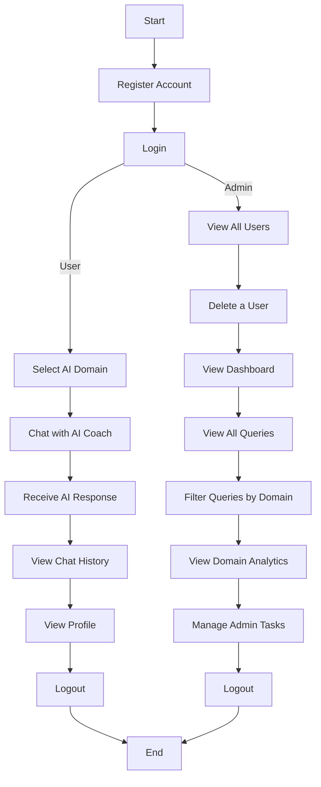

# LifeAlly — System Flow Chart

## 3.2 System Flow Chart

A system flowchart is a visual representation that illustrates how data, processes, and decisions flow through a system from start to finish. It uses standardized symbols like rectangles for processes, diamonds for decisions, and arrows to show the direction of flow, making complex processes easier to understand. By mapping the sequence of operations and interactions between different components, a system flowchart helps in analyzing, designing, and troubleshooting systems efficiently, ensuring clarity in how the system functions.

---

---

## Flow Description

### User Flow
After logging in as a **User**, the system directs the user through the following steps:

1. **Register Account** — New users create an account with name, email and password.
2. **Login** — Authenticated using email and password with werkzeug hashing.
3. **Select AI Domain** — User picks one of four domains: Career, Finance, Health, or Relationship.
4. **Chat with AI Coach** — User submits a natural language query to the AI pipeline.
5. **Receive AI Response** — System runs ML models and Gemini LLM to generate personalized advice.
6. **View Chat History** — User can review previous AI coaching conversations.
7. **View Profile** — User views their account details and domain memory.
8. **Logout** — Session is cleared from localStorage.

---

### Admin Flow
After logging in as an **Admin**, the system provides management capabilities:

1. **Login** — Admin authenticates using the same login endpoint with `role = admin`.
2. **View All Users** — Paginated list of all registered users in the platform.
3. **Delete a User** — Admin can remove a user (system blocks deletion of admin accounts).
4. **View Dashboard** — Overview of total users, total queries, and domain usage statistics.
5. **View All Queries** — Full paginated log of all AI coaching queries across users.
6. **Filter Queries by Domain** — Narrow queries by career, finance, health, or relationship.
7. **View Domain Analytics** — Visual chart showing which domains are used most.
8. **Manage Admin Tasks** — Admin internal to-do tracker for platform management.
9. **Logout** — Session is cleared from sessionStorage.

---

*LifeAlly — System Flow Chart · February 2026*
